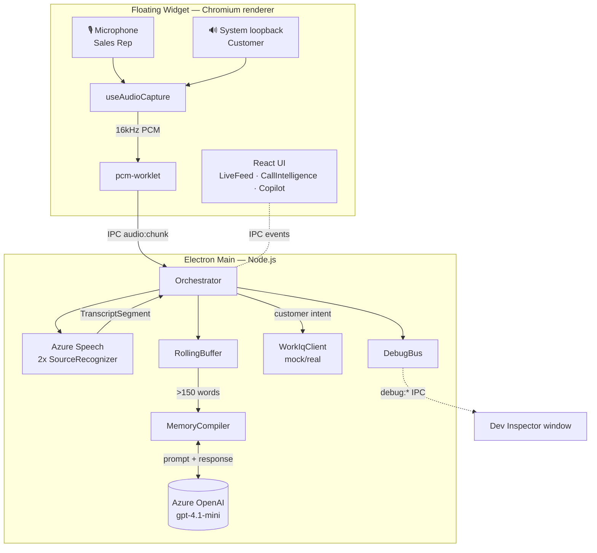
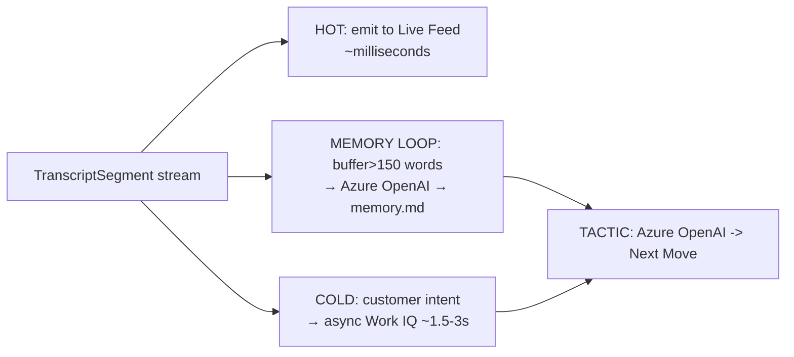
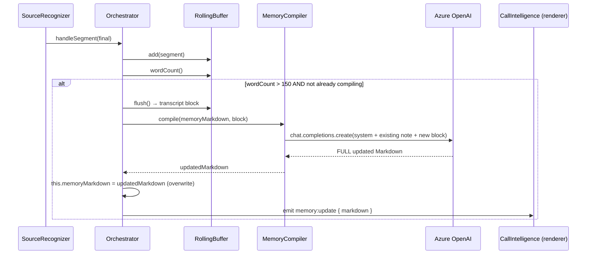
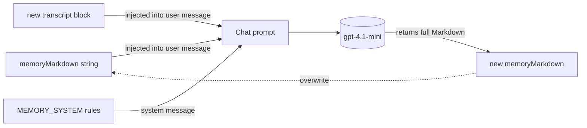
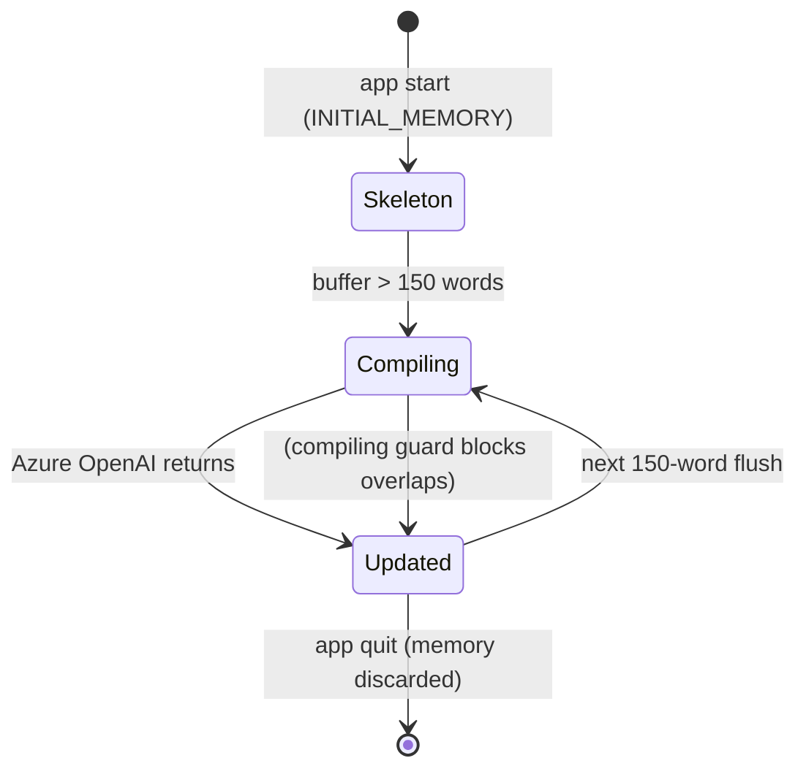
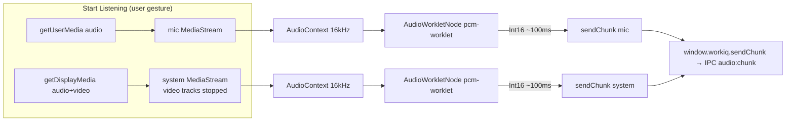
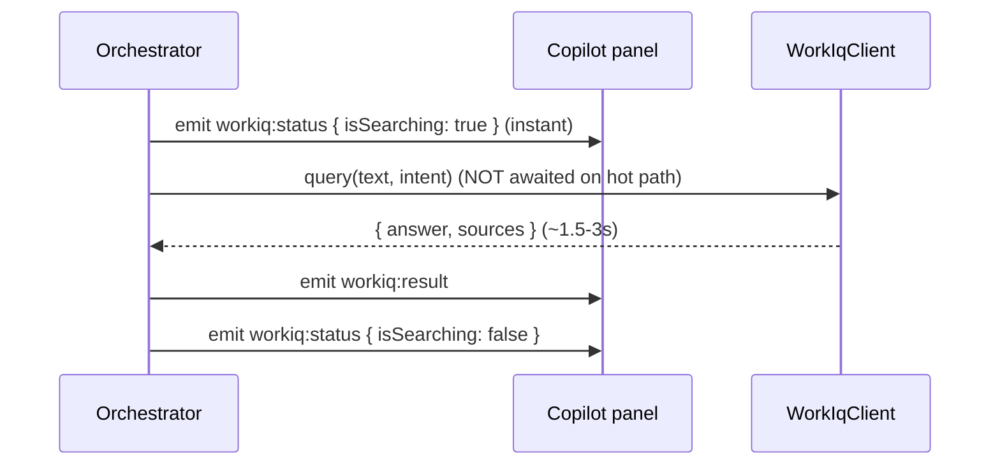

# WorkIQ Sales Copilot — Design Document

> An always-on-top, floating desktop assistant that listens to a live Microsoft Teams
> sales call, maintains a rolling Markdown "memory" of the conversation with Azure
> OpenAI, transcribes both sides with Azure Speech, and surfaces grounded enterprise
> answers (Microsoft Work IQ — currently mocked) and real-time sales tactics.

**Status:** Proof of Concept (hackathon)
**Stack:** Electron 33 · TypeScript · React 18 · Vite 5 · Tailwind 3 · npm workspaces
**Azure:** Azure AI Speech (real-time STT) · Azure OpenAI (gpt-4.1-mini) · Work IQ (mock, swappable)

---

## Table of Contents

1. [Goals & Non-Goals](#1-goals--non-goals)
2. [System Overview](#2-system-overview)
3. [Process & Package Architecture](#3-process--package-architecture)
4. [The Three Loops](#4-the-three-loops)
5. [The AI Memory Subsystem](#5-the-ai-memory-subsystem) ← *where memory lives & how the AI accesses it*
6. [Audio Capture Pipeline](#6-audio-capture-pipeline)
7. [Speech-to-Text & Speaker Attribution](#7-speech-to-text--speaker-attribution)
8. [Orchestrator](#8-orchestrator)
9. [Intent Detection & Work IQ (Cold Path)](#9-intent-detection--work-iq-cold-path)
10. [Sales Tactics](#10-sales-tactics)
11. [IPC Contract](#11-ipc-contract)
12. [Floating Widget UI](#12-floating-widget-ui)
13. [Dev Inspector & Observability](#13-dev-inspector--observability)
14. [Resilience & Error Handling](#14-resilience--error-handling)
15. [Security Model](#15-security-model)
16. [Configuration](#16-configuration)
17. [Build, Run & Tasks](#17-build-run--tasks)
18. [File Map](#18-file-map)
19. [Known Limitations & Future Work](#19-known-limitations--future-work)

---

## 1. Goals & Non-Goals

### Goals
- **Zero-latency "hot path":** capturing audio and streaming transcription must never stutter, regardless of how slow downstream enterprise calls are.
- **Decoupled enrichment:** LLM memory compilation and Work IQ lookups run asynchronously and push results to the UI when ready.
- **Deterministic speaker attribution:** know who is the rep vs the customer with certainty.
- **Always-on-top, translucent overlay** that floats over a Teams call.
- **Runs instantly** with mocks; flips to real services purely via configuration.
- **Deep observability** for demo/debug via a dedicated Dev Inspector window.

### Non-Goals (for this POC)
- Production packaging / code signing / auto-update.
- A real Microsoft Work IQ endpoint (mocked behind a swappable interface).
- Persisting conversation history across sessions (memory is ephemeral — see §5 and §19).
- Multi-call management or CRM write-back.

---

## 2. System Overview



The app is one Electron application composed of **two OS processes**:
- The **main process** (Node.js) — owns windows, audio routing, all Azure SDK calls, and orchestration.
- One or more **renderer processes** (Chromium) — the floating widget UI, and (in dev) the Dev Inspector.

They communicate only through a **preload bridge** + Electron IPC.

---

## 3. Process & Package Architecture

A `npm workspaces` monorepo. One package per concern.

```text
workiq-sales-copilot/
├── packages/
│   ├── types/     @workiq/types     — shared interfaces + IPC channel constants
│   └── config/    @workiq/config    — shared tsconfig.base.json
└── apps/
    ├── desktop-client/   @workiq/desktop-client   — Electron MAIN + preload (Node, tsup→CJS)
    └── floating-widget/  @workiq/floating-widget  — Electron RENDERER (React+Vite+Tailwind)
```

| Concern | Process | Package | Can use |
|---|---|---|---|
| Windows, audio routing, Azure SDKs, orchestration | **Main** | `desktop-client` | Node + npm packages. No DOM. |
| Translucent UI, audio capture (Web Audio) | **Renderer** | `floating-widget` | DOM + browser APIs. No direct Node. |
| Secure bridge | preload (in renderer) | `desktop-client` | `ipcRenderer` → exposes `window.workiq` |
| Shared contracts | both | `types` | pure TypeScript |

**Why two build tools:** `tsup` (esbuild → CommonJS) compiles the Node main + preload to `dist/main.js` & `dist/preload.js`; `vite` serves/bundles the browser app. `@workiq/types` points at TS source and is inlined by both bundlers (`noExternal` for tsup).

---

## 4. The Three Loops

Everything fans out from one stream of `TranscriptSegment`s into three independent loops, so the latency of one never blocks another.



| Loop | Trigger | Latency budget | Blocking? |
|---|---|---|---|
| **Hot path** | every interim/final segment | ~ms | never |
| **Memory loop** | buffer crosses 150 words at a final segment | ~0.5–2 s (LLM) | guarded, async |
| **Cold path** | customer utterance matches an intent | ~1.5–3 s (Work IQ) | fire-and-forget |
| **Tactic** | memory or grounding update | ~1 s (LLM) | async |

---

## 5. The AI Memory Subsystem

> **This is the section answering: "where is the AI memory written, and how does the AI access it?"**

### 5.1 What "memory" is

The memory is a single **GitHub-flavored Markdown document** — the live "CRM note" for the call — with a fixed five-section skeleton:

```markdown
## Customer
## Pain Points
## Objections
## Requirements
## Next Steps
```

It starts from the `INITIAL_MEMORY` constant in
[`apps/desktop-client/src/orchestrator/prompts.ts`](../apps/desktop-client/src/orchestrator/prompts.ts).

### 5.2 Where it is stored (today)

> ⚠️ **It is NOT a file on disk.** Despite the conceptual name "memory.md," there is no `.md`
> file written anywhere right now.

The authoritative copy is a **plain JavaScript string held in the Electron main process**, as a
private field of the `Orchestrator` instance:

```ts
// apps/desktop-client/src/orchestrator/Orchestrator.ts
export class Orchestrator {
  private memoryMarkdown = INITIAL_MEMORY;   // ← the entire "AI memory" lives here
  private compiling = false;                  // ← re-entrancy guard
  ...
}
```

| Property | Value |
|---|---|
| **Location** | RAM, inside the `Orchestrator` object in the **main** process |
| **Type** | a single `string` (Markdown) |
| **Lifetime** | the app session — **reset to `INITIAL_MEMORY` on every restart** |
| **Persistence** | none (no disk, no DB) |
| **Authoritative owner** | the main process only |
| **Renderer copy** | a **read-only mirror** pushed via `memory:update`; the UI never writes back |

### 5.3 How it is written

The memory is rewritten by the **memory loop**. The trigger and write path:



Key mechanics (in `Orchestrator.handleSegment` → `Orchestrator.compileMemory`):
- The **`RollingBuffer`** accumulates only **finalized** utterances. When its running word count exceeds **`FLUSH_WORD_THRESHOLD = 150`** *at a final segment* (a natural pause), it flushes.
- `flush()` drains the buffered utterances into one labeled block, e.g.:
  ```
  Customer: how much is the enterprise plan per seat?
  Sales Rep: it's fifty-eight dollars per user per month...
  ```
- The `compiling` boolean prevents overlapping LLM calls (a second flush is skipped while one is in flight).
- On success the **entire** returned Markdown **replaces** `memoryMarkdown` (full-document rewrite, never a diff), and a `memory:update` event is pushed to the widget.

### 5.4 How the AI accesses it

The LLM is **stateless** — it has no server-side memory of the call. "Memory" is implemented as
**in-context prompt injection**: every compile sends the *current* note plus the new transcript,
and the model returns the next version. This happens in
[`apps/desktop-client/src/orchestrator/MemoryCompiler.ts`](../apps/desktop-client/src/orchestrator/MemoryCompiler.ts):

```ts
async compile(currentMarkdown: string, transcriptBlock: string): Promise<string> {
  if (!this.client) return currentMarkdown;             // no-op without Azure keys
  const completion = await this.client.chat.completions.create({
    model: env.openAiDeployment,                        // gpt-4.1-mini
    temperature: 0.2,
    messages: [
      { role: 'system', content: MEMORY_SYSTEM },       // the rules (sections, "return FULL note")
      { role: 'user', content:
        `EXISTING note:\n${currentMarkdown}\n\n` +       // ← the AI "reads" memory here
        `NEW transcript block:\n${transcriptBlock}\n\n` +
        `Return the full updated note.` },
    ],
  });
  return completion.choices[0]?.message?.content?.trim() || currentMarkdown;
}
```

So the data flow of "access" is:



The **system prompt** (`MEMORY_SYSTEM` in `prompts.ts`) constrains the model to keep the exact
five sections, merge rather than drop facts, stay concise, and **output only Markdown**:

> "You maintain a live B2B sales-call CRM note in GitHub-flavored Markdown. You are given the
> EXISTING note and a NEW transcript block… Return the FULL, UPDATED note — never a diff…
> Output ONLY the Markdown note."

The Azure OpenAI client is constructed once in the `MemoryCompiler` constructor using the
`AzureOpenAI` class from the `openai` package, configured from environment (`AZURE_OPENAI_ENDPOINT`,
`AZURE_OPENAI_API_KEY`, `AZURE_OPENAI_DEPLOYMENT`, `AZURE_OPENAI_API_VERSION`). If those are unset,
`compile()` and `tactic()` are **no-ops** that return the input unchanged, so the app still runs.

### 5.5 How the memory is consumed elsewhere

- **The UI** receives `memory:update` and renders the Markdown read-only in the
  **Call Intelligence** panel ([`CallIntelligence.tsx`](../apps/floating-widget/src/components/CallIntelligence.tsx))
  via `react-markdown`.
- **The tactic generator** (`MemoryCompiler.tactic`) reads `memoryMarkdown` as additional context
  when suggesting the next move (see §10).
- **The Dev Inspector** shows the raw Markdown live (it pulls the latest `memory` debug event's
  `data.markdown`).

### 5.6 Lifecycle / state machine



### 5.7 Making it durable (not yet implemented)

To persist memory across restarts, the design would:
1. On write, also `fs.writeFile(path.join(app.getPath('userData'), 'memory.md'), markdown)`.
2. On boot, `fs.readFile` that path into `memoryMarkdown` if present.
3. Optionally key the filename by a call/session id for history.

This is intentionally deferred (see §19).

---

## 6. Audio Capture Pipeline

Implemented in [`apps/floating-widget/src/hooks/useAudioCapture.ts`](../apps/floating-widget/src/hooks/useAudioCapture.ts)
and the AudioWorklet [`apps/floating-widget/public/pcm-worklet.js`](../apps/floating-widget/public/pcm-worklet.js).



Details:
- **System loopback** (hearing the remote customer) is granted by the main process with
  `session.setDisplayMediaRequestHandler((req, cb) => cb({ video: screen, audio: 'loopback' }))`
  (Electron ≥ 31), so `getDisplayMedia` returns desktop audio **without a picker**. The video track is immediately stopped.
- Capture must start from a **user gesture** (the "Start Listening" button), because `getDisplayMedia` requires transient activation.
- Each stream runs through its own `AudioContext({ sampleRate: 16000 })`. The worklet converts Float32 → 16-bit PCM and **batches ~100 ms (1600 samples)** before posting, to keep IPC traffic low (~10 messages/s/source).
- A muted gain node keeps the graph "pulled" without echoing audio to the speakers.

---

## 7. Speech-to-Text & Speaker Attribution

Implemented in [`apps/desktop-client/src/speech/SourceRecognizer.ts`](../apps/desktop-client/src/speech/SourceRecognizer.ts).

### 7.1 Two recognizers, one per source

Rather than acoustic diarization, the app uses **source-based attribution**: two physically
separate audio streams, each fed into its own continuous Azure `SpeechRecognizer`.

| Stream | Recognizer label | `speaker` |
|---|---|---|
| Microphone | `Sales Rep` | `Speaker_1` |
| System loopback | `Customer` | `Speaker_2` |

Because the streams are electrically separate, attribution is **deterministic** — no mislabeling.

Each recognizer:
- Uses `PushAudioInputStream` with `getWaveFormatPCM(16000, 16, 1)`.
- Fires `recognizing` → interim text (`isFinal: false`) and `recognized` → finalized text (`isFinal: true`).
- Emits a `TranscriptSegment { speaker, speakerLabel, text, isFinal, ts }`.

### 7.2 What Azure can / can't identify

- **Diarization** (`ConversationTranscriber`) could split multiple speakers *within one stream* into anonymous `Guest-1/Guest-2`. Not used (source separation is more reliable for the 2-party case).
- **Speaker Recognition** (voiceprint identity) is a Limited-Access Azure feature requiring per-person enrollment — not applicable to unknown customers.
- **Limitation:** multiple remote participants all arrive on the loopback stream and are currently merged into "Customer". Splitting them would require running `ConversationTranscriber` on the loopback stream only.

---

## 8. Orchestrator

[`apps/desktop-client/src/orchestrator/Orchestrator.ts`](../apps/desktop-client/src/orchestrator/Orchestrator.ts)
is the central nervous system. It owns the recognizers, the buffer, the memory, the intent detector,
the Work IQ client, and the tactic timer.

Key constants:
```ts
const FLUSH_WORD_THRESHOLD = 150;   // memory compile trigger
const TACTIC_INTERVAL_MS = 60_000;  // tactic cadence
const HISTORY_LIMIT = 40;           // capped rolling history for tactic context
```

`handleSegment(segment)` is the hub:
1. **Always** `emit(TranscriptSegment)` → Live Feed (hot path), even interims.
2. Ignore non-final beyond that.
3. On final: append to `RollingBuffer` and the capped `history`.
4. If `speaker === 'Speaker_2'` (customer) and an intent matches → fire the async Work IQ lookup.
5. If `buffer.wordCount() > 150` and not already compiling → flush + compile memory.

`injectTranscript(speaker, text)` is a dev hook (used by the Dev Inspector) that synthesizes a
finalized segment and runs it through the *exact same* `handleSegment` path — letting you exercise
intents/memory without speaking.

---

## 9. Intent Detection & Work IQ (Cold Path)

### 9.1 Intent detection
[`IntentDetector.ts`](../apps/desktop-client/src/orchestrator/IntentDetector.ts) keyword-scans
finalized **customer** text and returns the first matching `SalesIntent`:

`pricing · security · sla · contract · integration · compliance · competitor · discount`

### 9.2 Work IQ client (mock, swappable)
[`WorkIqClient.ts`](../apps/desktop-client/src/workiq/WorkIqClient.ts) is an interface with a factory:

```ts
export function createWorkIqClient(): WorkIqClient {
  if (env.workIqMode === 'real' && env.workIqApiBase) return new RestWorkIqClient();
  return new MockWorkIqClient();
}
```

- [`MockWorkIqClient.ts`](../apps/desktop-client/src/workiq/MockWorkIqClient.ts) returns canned, intent-specific grounded answers + SharePoint/email source chips after a simulated **1.5–3 s** delay (models enterprise latency).
- [`RestWorkIqClient.ts`](../apps/desktop-client/src/workiq/RestWorkIqClient.ts) is the real implementation: a non-blocking `fetch` POST with an Entra ID bearer token (placeholder), activated by `WORKIQ_MODE=real`.

### 9.3 Cold path flow



---

## 10. Sales Tactics

`Orchestrator.generateTactic()` runs after memory or grounding changes:
- Takes the last 8 exchanges from `history`.
- Calls `MemoryCompiler.tactic(memoryMarkdown, recent, groundedFacts)` -> Azure OpenAI (`temperature 0.15`, `max_tokens 120`).
- The prompt emits a short label and one line the rep can say next.
- Emits `copilot:tactic`, rendered as the Next Move panel.

---

## 11. IPC Contract

All channel names are defined once in [`packages/types/src/index.ts`](../packages/types/src/index.ts)
(`IPC` const) and shared by both processes.

| Channel | Direction | Payload | Purpose |
|---|---|---|---|
| `audio:start` / `audio:stop` | R → M | — | capture lifecycle (logging) |
| `audio:chunk` | R → M | `{ source, buffer }` | 16 kHz PCM frames |
| `transcript:segment` | M → R | `TranscriptSegment` | live feed |
| `memory:update` | M → R | `MemoryState { markdown }` | Call Intelligence |
| `workiq:status` | M → R | `{ query, isSearching }` | searching badge |
| `workiq:result` | M → R | `WorkIqResponse` | grounded answer |
| `copilot:tactic` | M → R | `CopilotTactic` | tactic banner |
| `debug:init` | M → R | `DebugSnapshot` | inspector backfill |
| `debug:event` | M → R | `DebugEvent` | live event log |
| `debug:metrics` | M → R | `DebugMetrics` | counters/gauges (1 Hz) |
| `debug:test-transcript` | R → M | `{ speaker, text }` | transcript injector |
| `debug:clear` | R → M | — | clear inspector |

The renderer only ever sees the typed surface exposed by
[`preload.ts`](../apps/desktop-client/src/preload.ts) as `window.workiq`. **Azure keys never cross
this bridge** — they live only in the main process.

---

## 12. Floating Widget UI

[`apps/floating-widget`](../apps/floating-widget) — React + Vite + Tailwind + framer-motion.

- **Window:** frameless, `transparent: true`, `alwaysOnTop` (`screen-saver` level), draggable via
  `-webkit-app-region: drag`. The body is transparent so the desktop shows through.
- **Routing:** the same bundle serves both windows. [`main.tsx`](../apps/floating-widget/src/main.tsx)
  renders `<DevInspector/>` when `?view=debug`, else `<App/>`.
- **State:** [`useCopilotState.ts`](../apps/floating-widget/src/hooks/useCopilotState.ts) subscribes to
  all `window.workiq.on*` events and exposes render-ready state.
- **Primary modules:**
  1. **Conversation** — key-note pills with grounded answers, source chips, and follow-up chat.
  2. **Live Transcript** — compact capture confirmation grouped by speaker.
  3. **Next Move** — the latest grounded coaching line.

---

## 13. Dev Inspector & Observability

A **second, dev-only window** ([`DevInspector.tsx`](../apps/floating-widget/src/components/DevInspector.tsx))
opened by the main process when `!app.isPackaged`, loading `…:5173/?view=debug`.

It is driven by the [`DebugBus`](../apps/desktop-client/src/debug/DebugBus.ts) singleton in the main
process, which every stage logs into. The bus keeps a ring buffer (600 events) + counters/gauges,
mirrors to the console, backfills a new inspector via `debug:init`, streams `debug:event`, and emits
a `debug:metrics` snapshot every second.

Inspector features:
- **Status pills** (Speech/OpenAI configured, Work IQ mode, deployment).
- **Metric cards:** mic/system chunks (+KB), finals, buffer words, intents, Work IQ calls (+last ms), memory compiles (+last ms), tactics.
- **Color-coded event log** with level + free-text filters, pause, and clear; expandable JSON payloads.
- **Live `memory.md` pane** (raw Markdown as it evolves).
- **Transcript Injector** ⭐ — type a line or hit a quick-intent button → `sendTestTranscript` →
  `Orchestrator.injectTranscript` → the full pipeline runs **without speaking**.

---

## 14. Resilience & Error Handling

- **Speech auto-reconnect:** `SourceRecognizer` treats an *error* cancellation (e.g. a transient
  `getaddrinfo ENOTFOUND` DNS blip) as recoverable. It rebuilds a fresh push stream + recognizer with
  **exponential backoff** (`1s → 2s → 4s … capped 15s`), resets the backoff on `sessionStarted`, and
  stops reconnecting on intentional `close()`. `write()` is defensive during the reconnect window.
- **Graceful degradation without keys:** missing Speech keys → no recognizers (UI still runs);
  missing OpenAI keys → `compile()`/`tactic()` are no-ops; Work IQ defaults to mock.
- **Re-entrancy guard:** `compiling` prevents overlapping memory compiles.
- **Cold path isolation:** Work IQ is fire-and-forget; failures are logged, never thrown onto the audio path.

---

## 15. Security Model

- **Secret isolation:** all Azure keys live in `.env`, read only by the main process (`env.ts` via `dotenv`). The preload exposes **callbacks only** — no secrets reach the renderer.
- **Renderer hardening:** `contextIsolation: true`, `nodeIntegration: false`. The UI cannot touch Node or the filesystem.
- **Local-only content:** windows load `127.0.0.1:5173` (dev) or local files (prod); no remote code.
- **Loopback grant** is scoped through `setDisplayMediaRequestHandler`; no arbitrary screen sharing.

---

## 16. Configuration

`.env` (copied from `.env.example`), read by the main process only:

```bash
AZURE_SPEECH_KEY=...
AZURE_SPEECH_REGION=eastus
AZURE_OPENAI_ENDPOINT=https://oai-workiq-...openai.azure.com
AZURE_OPENAI_API_KEY=...
AZURE_OPENAI_DEPLOYMENT=gpt-4.1-mini     # must match your Azure deployment name
AZURE_OPENAI_API_VERSION=2024-08-01-preview
WORKIQ_MODE=mock                          # set 'real' + base/token to hit a live endpoint
WORKIQ_API_BASE=
WORKIQ_BEARER_TOKEN=
```

---

## 17. Build, Run & Tasks

Scripts (root [`package.json`](../package.json)):
- `npm run dev` → `concurrently` runs **vite** (widget @ `127.0.0.1:5173`) + (`wait-on` → `tsup` → `electron .`).
- `npm run build` → `vite build` (widget) + `tsup` (main/preload).
- `npm run typecheck` → `tsc --noEmit` for both apps.

VS Code tasks (group `workiq`):
- **WorkIQ: Install** — `npm install`.
- **WorkIQ: Dev** — `npm run dev` (background).
- **WorkIQ: Stop** — frees port 5173 and kills the WorkIQ Electron processes.

Dev vs prod: in dev the window loads the Vite URL (HMR for the UI); renderer edits hot-reload, **main-process edits require restarting** the dev task (tsup builds once at launch). In prod the window would `loadFile` the built `index.html`.

> **Windows gotcha (resolved):** Vite must bind `127.0.0.1` (not `localhost`/IPv6) so `wait-on tcp:127.0.0.1:5173` and Electron resolve it.

---

## 18. File Map

```text
workiq-sales-copilot/
├── package.json                 # workspaces + dev/build/typecheck scripts
├── .env.example                 # Azure + Work IQ config template
├── docs/DESIGN.md               # this document
├── packages/
│   ├── types/src/index.ts       # shared interfaces + IPC channel constants + debug types
│   └── config/tsconfig.base.json
└── apps/
    ├── desktop-client/          # ELECTRON MAIN
    │   ├── tsup.config.ts
    │   └── src/
    │       ├── main.ts                  # windows, loopback grant, IPC, debug window
    │       ├── preload.ts               # window.workiq bridge
    │       ├── env.ts                   # dotenv + configured() checks
    │       ├── speech/SourceRecognizer.ts   # Azure Speech + auto-reconnect
    │       ├── orchestrator/
    │       │   ├── Orchestrator.ts       # the hub (owns memoryMarkdown)
    │       │   ├── RollingBuffer.ts      # 150-word flush buffer
    │       │   ├── MemoryCompiler.ts     # Azure OpenAI compile() + tactic()
    │       │   ├── IntentDetector.ts     # keyword → SalesIntent
    │       │   └── prompts.ts            # INITIAL_MEMORY, MEMORY_SYSTEM, TACTIC_SYSTEM
    │       ├── workiq/
    │       │   ├── WorkIqClient.ts       # interface + factory
    │       │   ├── MockWorkIqClient.ts   # canned grounded answers (1.5-3s)
    │       │   └── RestWorkIqClient.ts   # real REST (env-gated)
    │       └── debug/DebugBus.ts         # diagnostics hub
    └── floating-widget/         # ELECTRON RENDERER
        ├── vite.config.ts               # host 127.0.0.1, port 5173
        ├── public/pcm-worklet.js        # Float32 → Int16 PCM batches
        └── src/
            ├── main.tsx                 # routes ?view=debug → DevInspector
            ├── App.tsx                  # widget layout
            ├── workiq.d.ts              # window.workiq typings
            ├── hooks/
            │   ├── useAudioCapture.ts    # mic + loopback → PCM
            │   └── useCopilotState.ts    # subscribes to IPC events
            └── components/
                ├── LiveFeed.tsx
                ├── CallIntelligence.tsx  # renders memory.md
                ├── CopilotRecommendations.tsx
                └── DevInspector.tsx      # the debug window
```

---

## 19. Known Limitations & Future Work

| Area | Today | Future |
|---|---|---|
| **Memory persistence** | in-RAM string, lost on restart | write/read `userData/memory.md`; per-call history files |
| **Work IQ** | mocked | wire `RestWorkIqClient` + Entra `DefaultAzureCredential` |
| **Multiple remote speakers** | merged as "Customer" | `ConversationTranscriber` diarization on the loopback stream |
| **Memory growth** | full-document rewrite each compile | summarize/trim older sections to bound token cost |
| **Tactic cadence** | fixed 60 s | event-driven (on objection/intent) |
| **Packaging** | dev-run only | `electron-builder` installer + code signing |
| **Tests** | typecheck + build | unit tests for buffer/intent/memory; e2e smoke |

### Memory persistence sketch
```ts
// on write (Orchestrator.compileMemory, after overwrite):
await fs.promises.writeFile(this.memoryPath, this.memoryMarkdown, 'utf8');

// on boot (Orchestrator constructor/start):
this.memoryPath = path.join(app.getPath('userData'), 'memory.md');
if (fs.existsSync(this.memoryPath))
  this.memoryMarkdown = await fs.promises.readFile(this.memoryPath, 'utf8');
```

---

*End of document.*
